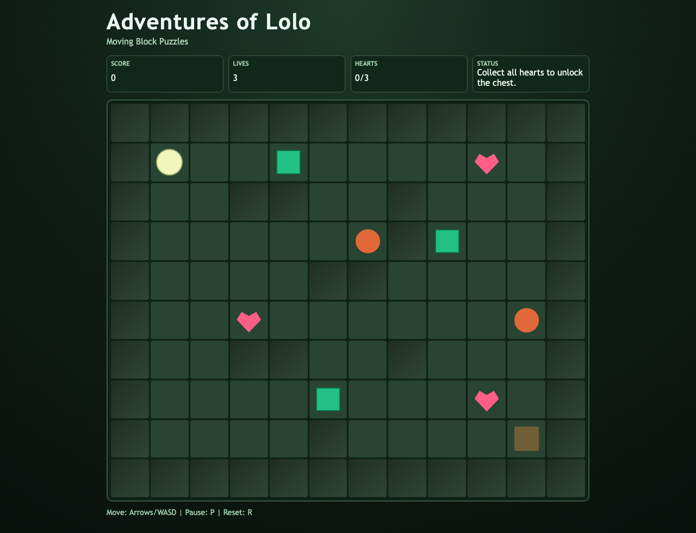

# daily-classic-game-2026-03-06-adventures-of-lolo-moving-block-puzzles

<p align="center"><strong>Adventures of Lolo: Moving Block Puzzles</strong><br/>Collect every heart, push emerald blocks, avoid patrolling snakey eyes, and unlock the goal chest.</p>
<p align="center"></p>

## Quick Start (pnpm only)

```bash
pnpm install
pnpm dev
```

## How To Play

- Move Lolo with Arrow keys or `WASD`.
- Push emerald blocks one tile at a time to open paths.
- Avoid enemy vision cones and moving enemies.
- Collect every heart to unlock the chest.
- Press `P` to pause/unpause.
- Press `R` to reset the level.

## Rules

- The level is a deterministic 12x10 grid.
- Lolo can push one block if the next tile is free.
- Enemy contact costs one life and resets actor positions.
- Game ends on zero lives or after all scripted levels are cleared.
- Chest tile is blocked until all hearts are collected.

## Scoring

- +100 per heart collected.
- +250 for each level completion.
- +10 survival bonus every 2 seconds without being hit.
- No random scoring multipliers.

## Twist

Moving-block puzzles: each level includes emerald blocks that must be pushed into tactical lanes to route around enemy patrols and reach every heart.

## Verification

```bash
pnpm test
node scripts/self-check.mjs
pnpm build
pnpm capture
```

## GIF Captures

- Opening layout and HUD: `clip-01-opening`
- Deterministic heart collection: `clip-02-heart-collection`
- Level finish and score jump: `clip-03-level-clear`

## Project Layout

- `src/` deterministic core and renderer
- `scripts/` self-check and Playwright capture
- `tests/` core-rule and determinism tests
- `artifacts/playwright/` screenshots and state captures
- `docs/plans/` per-run implementation plan
- `assets/` static assets
